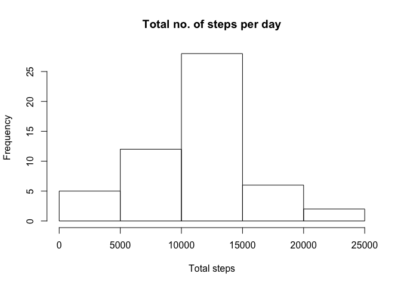
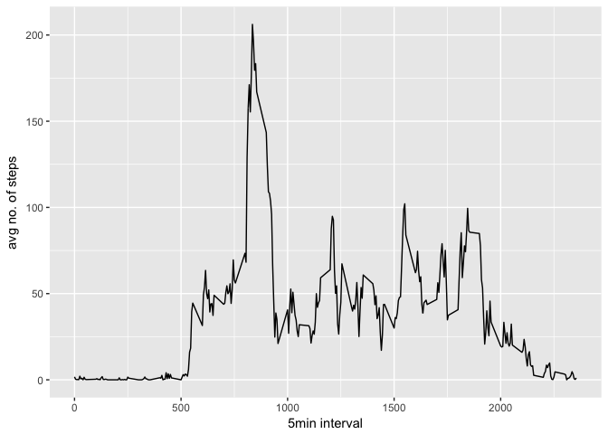
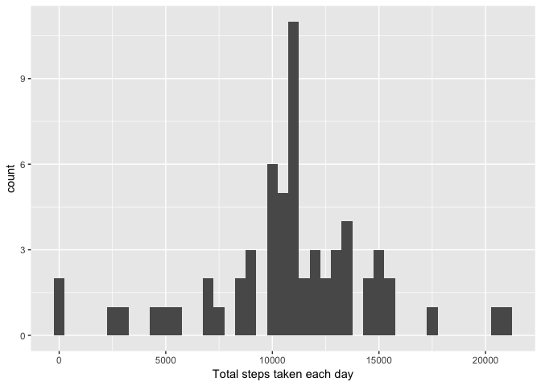
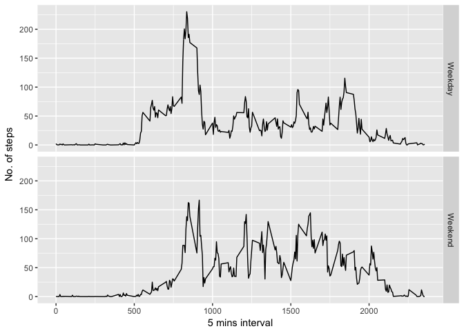

This is for assignment 1 of Coursera Reproducible Research

    library(ggplot2)

    ## Warning: package 'ggplot2' was built under R version 3.2.5

Read data after extraction

    data<-read.csv("activity.csv",header=TRUE)

sum data using Tapply then plot histogram

    steps_day<-tapply(data$steps,data$date,FUN=sum)
    hist(steps_day, main="Total no. of steps per day",xlab="Total steps")

calculate the mean and median of the steps taken

    mean_steps<-mean(data$steps,na.rm=TRUE)
    median_steps<-median(data$steps,na.rm=TRUE)

calculate average then plot time series graph

    average<-aggregate(x=list(steps=data$steps),by=list(interval=data$interval),FUN=mean,na.rm=TRUE)
    ggplot(data=average,aes(x=interval,y=steps))+geom_line()+xlab("5min interval")+ylab("avg no. of steps")

find number of steps and find Na values

    average[which.max(average$steps),]

    ##     interval    steps
    ## 104      835 206.1698

    #find and calculate number of NA values
    misvalue<-is.na(data$steps)
    table(misvalue)

    ## misvalue
    ## FALSE  TRUE 
    ## 15264  2304

create a function that fill values if NA

    fillvalues<-function(steps,interval){
        filled<-NA
        if(!is.na(steps))
            filled<-c(steps)
        else 
            filled<-(average[average$interval==interval,"steps"])
        return(filled)
    }

    #execute function
    filled.data<-data
    filled.data$steps<-mapply(fillvalues,filled.data$steps,filled.data$interval)

plot new graph based on filled values and calculate new median&mean

    steps_total<-tapply(filled.data$steps,filled.data$date,FUN=sum)
    qplot(steps_total,binwidth=500,xlab="Total steps taken each day")

    new_mean_steps<-mean(steps_total)
    new_median_steps<-median(steps_total)

seperate weekdays and weekends

    Whichday<-function(date){
        day<-weekdays(date)
        if(day %in% c("Monday","Tuesday","Wednesday","Thursday","Friday"))
            return("Weekday")
        else if(day %in% c("Saturday","Sunday"))
            return("Weekend")
        else 
            stop("Unknown date")
    }

    filled.data$date<-as.Date(filled.data$date)
    filled.data$day<-sapply(filled.data$date,FUN=Whichday)

plot graph with weekdays/weekends

    new_average<-aggregate(steps~interval+day,data=filled.data,mean)
    ggplot(new_average,aes(interval,steps))+geom_line()+facet_grid(day~.)+xlab("5 mins interval")+ylab("No. of steps")

